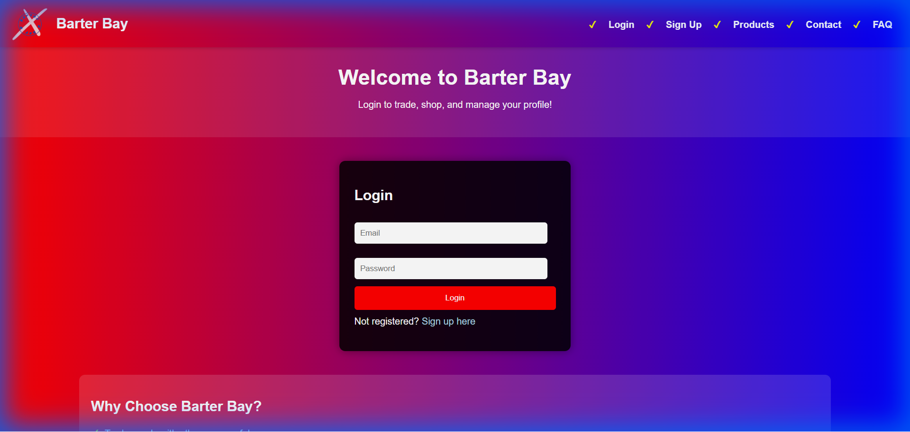
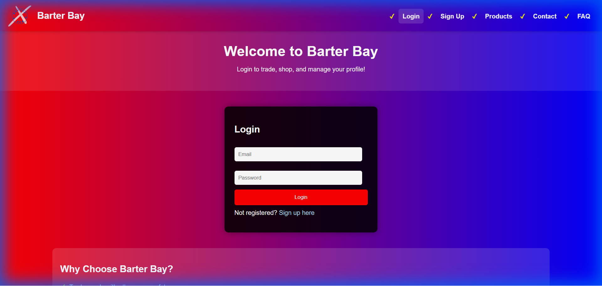
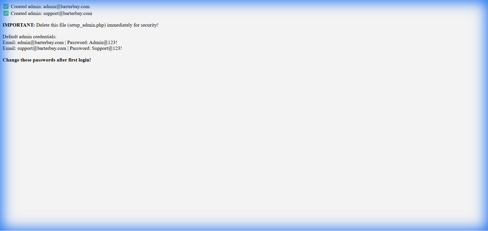

# 🛒 Barter Bay - Online Trading & E-commerce Platform


A modern web-based platform for secure buying, selling, and trading products. Built with PHP and SQLite, featuring Razorpay payment integration and a comprehensive trading system.

## ✨ Features

### 🛍️ E-Commerce
- **Product Browsing** - Search and filter products by category and price
- **Shopping Cart** - Add multiple items with quantity management
- **Secure Checkout** - Razorpay integration + Cash on Delivery
- **Purchase History** - Track all your orders
- **Product Ratings** - Rate and review products

### 🔄 Trading System
- **Product Trading** - Exchange items with other users
- **Trade Requests** - Send and receive trade proposals
- **Trade Management** - Approve or reject trade offers
- **Trade History** - View all your trading activity

### 👤 User Management
- **User Registration** - Secure signup with password hashing
- **User Authentication** - Session-based login system
- **Profile Management** - Update personal information
- **Role-Based Access** - Separate customer and admin portals

### 🔐 Admin Panel
- **User Management** - Add, edit, delete users
- **Product Management** - Full CRUD operations for products
- **Trade Oversight** - Monitor and manage all trades
- **Dashboard Analytics** - View system statistics

### 🔒 Security Features
- **SQL Injection Protection** - Prepared statements throughout
- **XSS Protection** - All outputs properly escaped
- **CSRF Protection** - Tokens on all forms
- **Password Hashing** - Bcrypt encryption
- **Session Security** - Secure session management
- **Input Validation** - Server-side validation

## 🚀 Quick Start

### Prerequisites
- PHP 8.2 or higher
- SQLite3 extension enabled
- Web server (Apache/Nginx) or PHP built-in server
- Razorpay account (for payment processing)

### Installation

1. **Clone the repository**
```bash
git clone https://github.com/SAILESH2508/Barter_Bay.git
cd barter-bay
```

2. **Configure environment**
```bash
# Copy environment template
cp .env.example .env

# Edit .env with your Razorpay credentials
nano .env
```

3. **Setup database**
```bash
# The database will be created automatically on first run
# Or you can create it manually:
touch barter_bay.db
chmod 644 barter_bay.db
```

4. **Setup admin accounts**
```bash
# Run setup_admin.php once in your browser
http://localhost/barter_bay/setup_admin.php

# DELETE setup_admin.php after running!
rm setup_admin.php
```

5. **Start the server**
```bash
# Using PHP built-in server
php -S localhost:8000

# Or configure your web server to point to the project directory
```

6. **Access the application**
```
http://localhost:8000
```

## 📁 Project Structure

```
barter-bay/
├── config.php              # Database & configuration
├── index.php               # Landing/login page
├── login.php               # User login
├── signup.php              # User registration
├── dashboard.php           # User dashboard
├── products.php            # Product listing
├── cart.php                # Shopping cart
├── buy.php                 # Checkout page
├── trade.php               # Trading interface
├── my_purchases.php        # Purchase history
├── my_trades.php           # Trade history
├── admin_dashboard.php     # Admin panel
├── navbar.php              # Navigation component
├── footer.php              # Footer component
├── images/                 # Product images
├── .env.example            # Environment template
├── .gitignore              # Git ignore rules
└── README.md               # This file
```

## 🔧 Configuration

### Environment Variables

Create a `.env` file or set these in your server environment:

```env
RAZORPAY_KEY_ID=your_razorpay_key_id
RAZORPAY_KEY_SECRET=your_razorpay_secret_key
```

### Default Admin Credentials

After running `setup_admin.php`:
- **Email:** admin@barterbay.com
- **Password:** Admin@123!

⚠️ **Change these immediately after first login!**

## 💳 Payment Integration

### Razorpay Setup

1. Sign up at [Razorpay](https://razorpay.com)
2. Get your API keys from the dashboard
3. Add keys to `.env` file
4. Test with test mode keys first
5. Switch to live keys for production

### Supported Payment Methods
- 💳 Credit/Debit Cards
- 🏦 Net Banking
- 📱 UPI
- 💰 Wallets
- 💵 Cash on Delivery (COD)

## 🗄️ Database Schema

### Main Tables
- **users** - Customer accounts
- **admins** - Administrator accounts
- **products** - Product catalog
- **cart** - Shopping cart items
- **purchases** - Order history
- **trades** - Trading transactions
- **reviews** - Product ratings

## 🛡️ Security

### Implemented Security Measures
- ✅ SQL Injection Protection (Prepared Statements)
- ✅ XSS Protection (Output Escaping)
- ✅ CSRF Protection (Tokens)
- ✅ Password Hashing (Bcrypt)
- ✅ Session Security
- ✅ Input Validation
- ✅ Secure Headers

### Security Score: 9.5/10


## 📱 Responsive Design

- ✅ Mobile-friendly interface
- ✅ Tablet optimized
- ✅ Desktop enhanced
- ✅ Touch-friendly navigation

## 🧪 Testing

### Manual Testing Checklist
- [ ] User registration
- [ ] User login
- [ ] Admin login
- [ ] Product browsing
- [ ] Add to cart
- [ ] Checkout (Razorpay)
- [ ] Checkout (COD)
- [ ] Trade request
- [ ] Purchase history
- [ ] Trade history

## 📚 Documentation
 
- **README.md** - Main project documentation


## 📸 Screenshots

### Home Page

*The landing page welcoming users to Barter Bay.*

### Login Page

*Secure login interface for accessing customer and admin accounts.*

### Admin Setup

*Initial setup screen for creating administrator accounts.*

### Trading Interface
*(Screenshot unavailable - Requires Login)*
The trading interface (`trade.php`) allows users to:
- **Search** for products by name or category.
- **View** details of products available for trade.
- **Propose** a trade by selecting one of their own items to exchange.
- **Status Indicators** show if a trade is pending, accepted, or rejected.

### My Trades
*(Screenshot unavailable - Requires Login)*
The `my_trades.php` page provides a comprehensive history of all trading activities:
- **Sent Requests**: Trades you have initiated.
- **Received Requests**: Offers from other users.
- **Visual Cards**: Shows images of both items involved in the trade.
- **Status Tracking**: Real-time updates on trade status (Pending, Accepted, Rejected).

## 🤝 Contributing

Contributions are welcome! Please follow these steps:

1. Fork the repository
2. Create a feature branch (`git checkout -b feature/AmazingFeature`)
3. Commit your changes (`git commit -m 'Add some AmazingFeature'`)
4. Push to the branch (`git push origin feature/AmazingFeature`)
5. Open a Pull Request

### Coding Standards
- Follow PSR-12 coding standards
- Use prepared statements for all database queries
- Escape all user outputs
- Add CSRF tokens to all forms
- Document complex functions

## 🐛 Known Issues

- None currently reported

## 📝 Changelog

### Version 1.0.0 (Current)
- ✅ Initial release
- ✅ Complete e-commerce functionality
- ✅ Trading system
- ✅ Admin panel
- ✅ Security hardening
- ✅ Payment integration

## 🔮 Future Enhancements

- [ ] Email notifications
- [ ] Password reset functionality
- [ ] Two-factor authentication
- [ ] Advanced search filters
- [ ] Product recommendations
- [ ] Wishlist feature
- [ ] Multi-language support
- [ ] Mobile app

## 📄 License

This project is licensed under the MIT License - see the [LICENSE](LICENSE) file for details.


- **Sailesh S** - *Initial work* - [SAILESH2508](https://github.com/SAILESH2508)


## 🙏 Acknowledgments

- Razorpay for payment gateway
- Icons from Icons8
- Inspiration from modern e-commerce platforms

## ⚠️ Disclaimer

This is a demonstration project. For production use:
- Change all default credentials
- Use production Razorpay keys
- Enable HTTPS
- Set up proper error logging
- Implement rate limiting
- Regular security audits

---

**Made with ❤️ for secure online trading**

⭐ Star this repo if you find it helpful!
